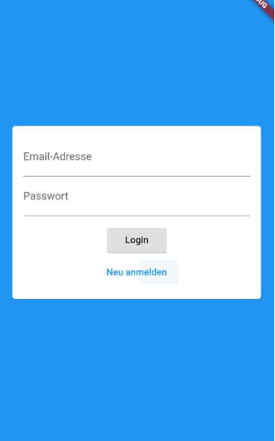
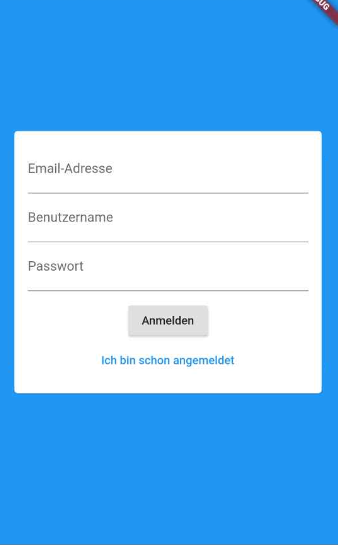
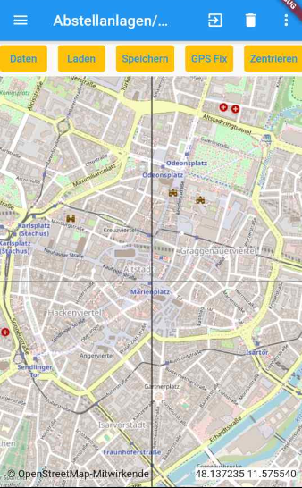
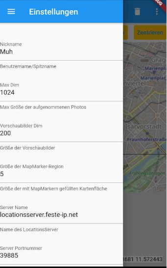
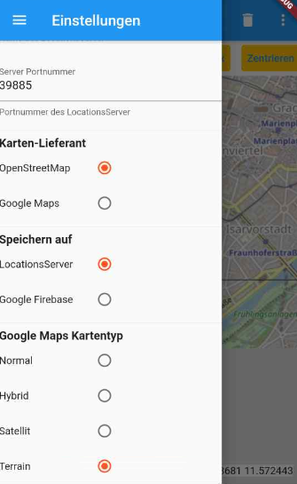
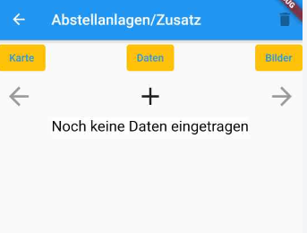
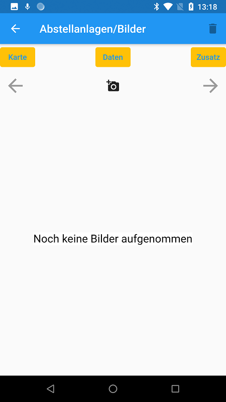

# locations (as of Nov. 2020)

An app to collect location-specific data and photos

Eine App zum Sammeln ortsspezifischer Daten und Fotos

The following short introduction to the app is targeted towards german users and thus written in german.
The internal documentation is written in english (best effort).

# Kurzeinführung in die App
## Kategorien
Mit der App lassen sich beliebige und ganz unterschiedliche Daten erfassen. Welche das sind, wird in einer Konfigurationsdatei festgelegt. Von denen kann es mehrere geben. Die App kommt mit 4 solcher Dateien, es lassen sich leicht weitere hinzufügen. Mit den 4 Beispiel-Dateien lassen sich Abstellanlagen, Abstellplätze (d.h. wünschbare Abstellanlagen), Alte Bäume oder Sitzbänke erfassen. Zu jeder Kategorie gehört ein Satz von Daten, die sich zu dieser Kategorie erfassen lassen. Bei den Abstellanlagen beispielsweise die Anzahl der Radständer, bei den alten Bäumen der Stammumfang, bei den Sitzbänken das Material der Sitzbank. Das sind Daten, die diesem Ort eindeutig zugeordnet werden. Daneben kann es für einen Ort mehrere Zusatzdaten geben. Ein Beispiel wäre bei den Abstellanlagen, an welchem Tag zu welcher Uhrzeit bei welchem Wetter die Anlage zu wieviel Prozent belegt war.

## Laden/Speichern
Die erfaßten Daten werden zentral in einem Server gespeichert. Die App kann Daten von dort laden oder neue oder geänderte Daten dahin speichern. Die Idee ist, daß man die existierenden Daten daheim über WLAN lädt, dann mit dem Handy  herumläuft und Daten evtl. ohne Internetverbindung erfaßt, und dann zuhause die Daten wieder speichert. Wenn man eine Internetverbindung hat, kann man das natürlich auch unterwegs machen. Die Daten verbrauchen wenig Datenvolumen, anders sieht es mit dem Laden und Speichern von Bildern aus.

Als Server stehen Google oder ein eigens eingerichter Server standardmäßig zur Verfügung. Da der Google-Server Kosten verursacht, ist er vielleicht nicht immer verfügbar, da er sich bei Kostenüberschreitung abschaltet.

Beim Laden wird immer nur ein Teil der gesamten Daten geladen, nämlich der in einem Bereich um den aktuellen Kartenmittelpunkt. Daten lassen sich aber für jeden Kartenort erfassen. Hat man die schon existierenden Daten vorher nicht geladen, birgt das natürlich die Gefahr der Doppelerfassung. Beim Speichern "gewinnt" immer der neueste Datensatz. Bei gleichen Koordinaten überschreibt der neue den alten Datensatz.

Beim Laden werden zuerst alle nicht neuen oder geänderten Daten und Fotos gelöscht. 

## Löschen
Gelöscht wird immer nur lokal. Daten auf dem Server werden also von der App nicht gelöscht. Waren die Daten vorher auf dem Server, sind sie nach "Laden" wieder da. Dauerhaft gelöscht werden nur Daten, die noch nicht gespeichert wurden.

## Die Seiten
Die App zeigt 6 verschiedene Seiten:
* Die Login-Seite zum Anmelden oder Einloggen.
* Die Kartenseite ist die Hauptseite.
* Die Datenseite zeigt oder erfaßt die Daten für einen Ort.
* Die Zusatzseite zeigt oder erfaßt die zusätzlichen Daten für einen Ort.
* Die Bilderseite zeigt die dazugehörigen Bilder.
* In der Fotoseite kann man ein Bild skalieren, rotieren und verschieben.
Daneben gibt es noch ein Fenster für die Einstellungen.

## Die Loginseite

Über diese Seite kann man sich mit einer Email-Adresse, einem Passwort und einem Benutzernamen anmelden, oder sich später wieder einloggen. Der Benutzername wird später bei allen Daten mitgespeichert.

## Die Kartenseite

In der oberen Zeile steht links das Torten-Icon mit den 3 waagerechten Strichen zum Aufklappen des Einstellungen-Dialogs. Dann kommt der Name der Kategorie mit /Karte dahinter (evtl. nur in der Queransicht sichtbar). Dann ein Logout-Icon zum Ausloggenm, ein Mülleimer-Icon zum Löschen, und 3 vertikale Punkte zum Auswählen der Kategorie. Das Ausloggen ist nur notwendig, wenn man den Benutzer wechseln möchte. 

Darunter stehen 5 Knöpfe:
* Daten: wechselt zur Datenseite.
* Laden: Lädt die Daten vom Server in einer gewissen Entfernung vom Mittelpunkt der Karte.
* Speichern: Speichert die seit dem letzten Speichern neuen oder geänderten Daten auf dem Server.
* GPS Fix: bewegt den Kartenmittelpunkt auf den aktuellen Standort.
* Zentrieren: bewegt den Kartenmittelpunkt auf den in der Konfigurationsdatei festgelegten Zentral-Ort. Für die Beispiele ist das immer der Marienplatz.

Die Karte zeigt ein Fadenkreuz und links unten die Koordinaten des Mittelpunkts. Sie läßt sich mit einem Finger verschieben und mit 2 Fingern skalieren. Die Karte läßt sich aber nicht aus dem in der Konfigurationsdatei festgelegten Bereich bewegen, in den Beispielen die Region oder die Stadt München.

Sieht man nach "Laden" auf der Karte MapMarker, kann man durch Antippen eines der Marker diesen zum Kartenmittelpunkt machen. Nach kurzer Zeit wird dann zur Datenseite mit den Daten des MapMarkers gewechselt.

Wenn am Kartenmittelpunkt ein MapMarker steht, werden durch Antippen des Mülleimer-Icons alle Daten, Zusatzdaten und Bilder dieses Ortes lokal gelöscht.

## Die Einstellungen

Zu den Einstellungen kommt man auf der Kartenseite über das Torten-Icon oben links, oder indem man von der linken Kante aus zur Bildmitte streicht.

Alle Einstellungen sind vorbelegt:
* MaxDim: Die Handy-Kamera kann Bilder erheblicher Größe erzeugen. Mit MaxDim wird das Bild so geschrumpft, daß die längste Kante MaxDim Pixels lang ist. Das spart Platz auf dem Handy und dem Server.
* Vorschaubilder Dim: In der Bilderseite wird zuerst vom Server ein Vorschaubild geladen. Erst wenn man es antippt, wird das Bild in voller Auflösung geladen. Beim Google-Server ist diese Größe fest auf 200 festgelegt, und dieser Parameter wird ignoriert.
* Größe der MapMarker-Region: Der Bereich, für den Daten durch "Laden" geladen werden, läßt sich durch diesen Parameter in der Größe verändern. Mit dem Wert 5 und dem Mittelpunkt Marienplatz wird in etwa der Bereich um den Altstadtring abgedeckt, mit einer Ausdehnung von ca. 1500m in Ost-West- und 1100m in Nord-Süd-Richtung. Für den Wert 10 ergäben sich ca. 3000m und 2200m. 
* Server Name: Der Name des eigenen Servers.
* Server Portnummer: Die Portnummer des eigenen Servers.
* Karten-Lieferant: Hier kann zwischen OpenStreetMap und Google Maps gewechselt werden. Die Verwendung von Google Maps verursacht Kosten.
* Speichern auf: Hier kann zwischen dem Google Server (Firebase) und dem eigenen Server gewechselt werden. Neue/geänderte Daten werden nur einmal auf dem eingestellten Server gespeichert!
* Google Maps Kartentyp: Wenn der Karten-Lieferant Google Maps ist, kann man hier die Kartenart ändern.

## Die Datenseite

Je nach Kategorie werden hier unterschiedliche Felder angezeigt. Das Bild zeigt die ersten Felder der Abstellanlagen. Gleichbleibend sind aber in der oberen Zeile der Zurück-Knopf und das Foto-Icon, und in der Zeile darunter die Knöpfe für Karte, Zusatzdaten und Bilder. Mit diesen wechselt man zur betreffenden Seite.

Wenn man in der Karte auf einen Marker getippt hat, wird der Kartenmittelpunkt kurz auf den Marker bewegt, und dann zur Datenseite mit den Daten des Markers gewechselt. Diese kann man jetzt betrachten und ggfs. ändern. War am Kartenmittelpunkt, auf den man vielleicht über GPS Fix gekommen ist, kein Marker, kann man jetzt auf der Datenseite einen neuen Ort erfassen. Wechselt man zurück zur Kartenseite, sieht man am Kartenmittelpunkt jetzt einen neuen Marker.

Die Felder lassen sich am einfachsten von oben nach unten befüllen, indem man in der Tastatur jedesmal auf den blauen Rechtspfeil unten rechts tippt. Bei Felder, die eine Wahl erfordern, wie z.B. beim Wetter gut/mittel/schlecht, reicht die Eingabe des ersten Buchstabens.

Mit dem Foto-Icon nimmt man ein (oder mehrere) Foto(s) des Ortes auf.

## Die Zusatzdatenseite

Je nach Kategorie werden hier Sätze von Zusatzdaten eingetragen. In der oberen Zeile gibt es den Zurück-Knopf und ein Mülleimer-Icon. In der Zeile darunter sind Knöpfe für die Karten-, Daten- oder Bilderseite. Darunter sind Knöpfe, mit denen man zum vorherigen oder nächsten Datensatz kommt, oder mit denen man einen neuen Satz anlegen kann. Auch durch Wischen nach links oder rechts kann man den Datensatz wechseln.

Durch Tippen auf das Mülleimer-Icon wird der aktuelle Datensatz lokal gelöscht.

## Die Bilderseite

In der oberen Zeile gibt es den Zurück-Knopf und ein Mülleimer-Icon. In der Zeile darunter sind Knöpfe für die Karten-, Daten- oder Zusatzseite. Darunter sind Knöpfe, mit denen man zum vorherigen oder nächsten Bild kommt, oder mit denen man ein neues Foto machen kann. Auch durch Wischen nach links oder rechts kann man das Bild wechseln.

Durch Tippen auf das Mülleimer-Icon wird das aktuell angezeigte Foto lokal gelöscht.

Erst in dem Moment, in dem man zur Bilderseite wechselt, wird das angezeigte Bild als Vorschaubild geladen und gespeichert. Tippt man auf das Bild, wird es in voller Auflösung geladen und gespeichert. Gespeicherte Bilder werden natürlich nicht neu geladen. Tippt man noch einmal auf das Bild, wird es auf einer neuen (Foto-)Seite gezeigt, wo man es skalieren, drehen und verschieben kann. Diese Seite hat nur einen Zurück-Knopf. 

# Servers
The app loads and stores data and images from/to an external server. Currently two of these are supported:
* One is a server running on a dedicated machine. This is typically a Linux Server running apache2, mysql, with a REST interface implemented by the Python modules Flask and SQLAlchemy, called "Locationsserver". Its sourcecode can be found at https://github.com/michaelu123/LocationsServer. Currently I use a Raspberry Pi 3B as server. It is attached to a FritzBox router. But as the router is connected to the internet only via DS-Lite, it has no IP V4 address. The mobile phone net, however, is still IP V4 based, and therefore the app cannot reach the server via IP V6. A provider https://www.feste-ip.net/ provides an IP V4 address via a proxy, so ultimately the Locationsserver can be reached via http://locationsserver.feste-ip.net:39885. An example REST call on this server displays a list of database tables: http://locationsserver.feste-ip.net:39885/tables. The Raspberry may not be running all the time. It should be quite easy to setup another Locationsserver, though, and configure its name and port number in the settings. 
* The other server is based on Google Firebase. Images are stored on Firebase Storage. The database is a Firebase Cloud Firestore. The connection between the App and Firebase is currently not configurable. Using Firebase costs money, and if the costs get too high, I might stop the server.

## Primary Keys, Quality Assurance
The sqlite database used by the app uses the fields (lat_round, lon_round) as primary key. These fields are strings produced by rounding the lat/lon values of the coordinates to "stellen" digits after the decimal point. "Stellen" is set in the configuration file for the category. 5 is the value normally used. The minimal distance between two points to be kept apart is a bit more than 1m for stellen=5, 10 cm for stellen=6, 10m for stellen=4, 100m for stellen=3. 

The MySQL database used by the Locationsserver uses the fields (creator, lat_round, lon_round) as primary key. This is meant to be used for quality assurance. Each app user, using his own username as creator, can store records for the same location, without causing a primary key violation against other users. It is then up to an admin to consolidate records for the same location from different users, or discard them. The creator name "OSM" is reserved for records coming from OSM. The name "STAMM" is reserved for consolidated records.

Likewise, the Firestore DB uses (lat_round, lon_round, creator) as the document id for "daten"-records, and (lat_round, lon_round, creator, uniq) as the document id for "zusatz"-records.

This ensures that no user can accidentally change the records of another user, or the OSM or STAMM records. Deletion is not possible anyhow, except for the DB admin/consolidator.

A Web Interface for a prospective consolidator must yet be written...

# Category definition files
